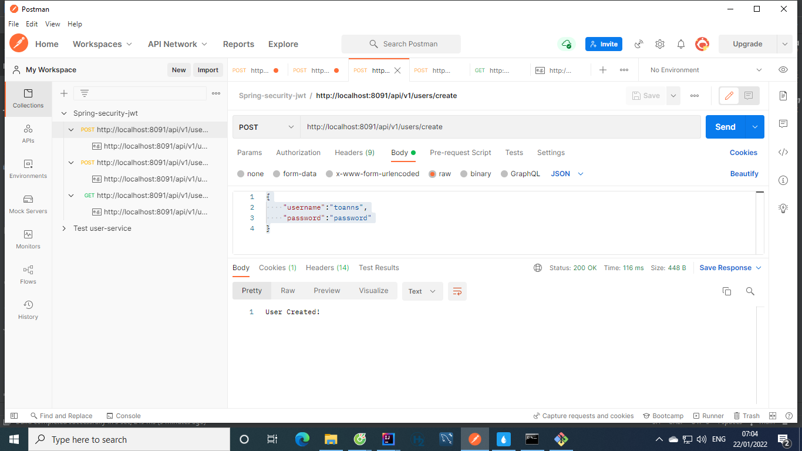
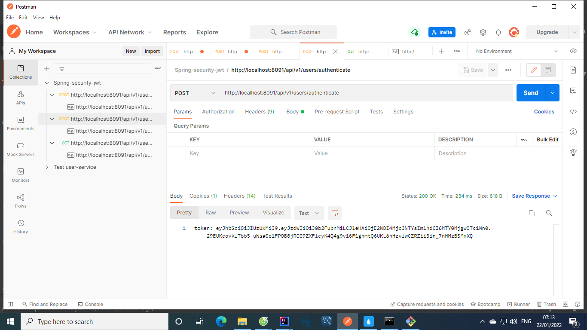
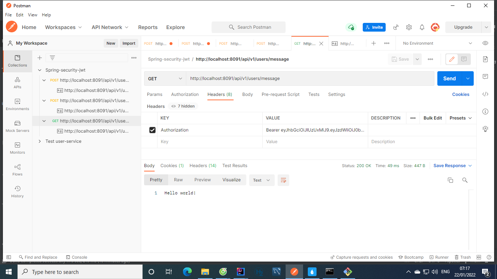

I. Test api with postman:
   - Create new user: localhost:8091/api/v1/users/create. Successful creation will have the response "user created" 

    - Get token: localhost:8091/api/v1/users/authenticate.  Go to the api and the Json body contains the username and password you just created. Success will get token

   - then access the get api: localhost:8091/api/v1/users/message with the header as shown to be able to get the secured data.
